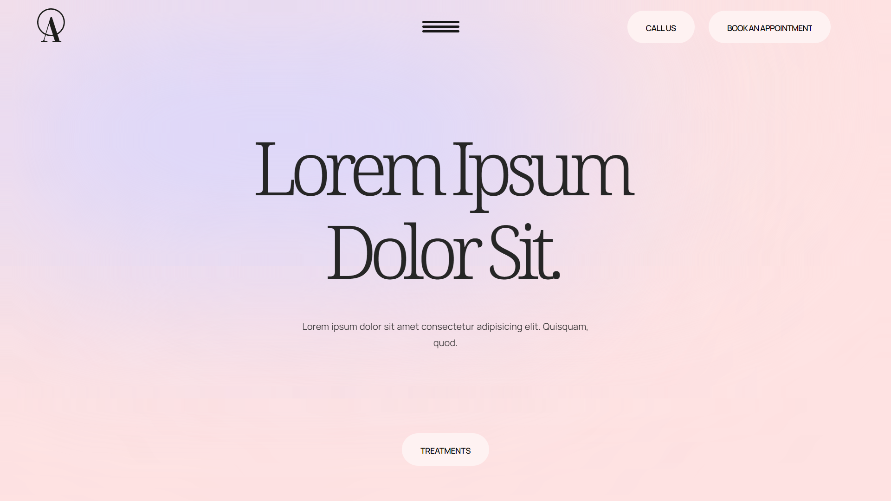

# React Base

[](https://react-base-pearl.vercel.app/)

This project aims to create an iconic static website for a company to establish its online presence and showcase its services. The website is built using React, Framer Motion, Tailwind CSS, Next.js 14, Vercel, and [Resend](https://resend.com/) for sending emails.

## Getting Started

To run the project locally, follow these steps:

1. Clone the project repository to your local machine.
2. Open the project in Visual Studio Code.
3. Install project dependencies by running the following command in the terminal:

   ```shell
   npm install
   ```

4. Start the development server by running the following command:

   ```shell
   npm run dev
   ```

5. Open a web browser and navigate to http://localhost:3000 to view the website.


## Problem

The company needs to have an online presence to effectively reach its target audience and showcase its services. A static website is a suitable solution for providing information about the company and what it does.

## Solution

The solution is to create a visually appealing and informative static website using modern web development technologies. The website will be built using React, a popular JavaScript library for building user interfaces. Framer Motion will be used to add smooth animations and transitions to enhance the user experience. Tailwind CSS will be used for efficient styling and layout. Next.js 14, a React framework, will be utilized for app routing and server-side rendering capabilities. Vercel will be used for deployment and hosting of the website.

Additionally, the website will integrate with Resend, a service for sending emails. This integration will allow users to contact the company directly from the website by filling out a contact form.


## Project Structure

The project structure is organized as follows:

- **`pages`**: This directory contains the Next.js pages that define the routes and content of the website.
- **`components`**: This directory contains reusable React components used throughout the website.
- **`styles`**: This directory contains global styles and utility classes defined using Tailwind CSS.
- **`public`**: This directory contains static assets such as images and fonts used in the website.

## Deployment

The website can be deployed using Vercel, a serverless hosting platform. To deploy the website to Vercel, follow these steps:

1. Sign up for a Vercel account at https://vercel.com.
2. Install the Vercel CLI by running the following command:

   ```shell
   npm install -g vercel
   ```

3. Log in to Vercel using the CLI:

   ```shell
   vercel login
   ```

4. Configure the project for deployment:

   ```shell
   vercel
   ```

5. Follow the prompts to select the project and configure the deployment settings.
6. Once configured, run the following command to deploy the website:

   ```shell
   vercel --prod
   ```

7. Vercel will provide a URL where the deployed website can be accessed.

## Conclusion

This project provides a solution for creating an iconic static website to establish the online presence of a company and showcase its services. By utilizing modern web development technologies such as React, Framer Motion, Tailwind CSS, Next.js, and Vercel, the resulting website will be visually appealing, performant, and user-friendly. Additionally, the integration with Resend enables users to easily contact the company through the website.

# Post

🎉🎉 Excited to announce the completion of my latest project! 🎉🎉

I'm thrilled to share that I've successfully completed a classic, yet high-class website. The journey took longer than anticipated, but the end result is satisfying.

You can check out the website at https://react-base-pearl.vercel.app/. Feel free to explore and experience the portfolio firsthand!

The primary objective of this project was to create a visually appealing and informative static website using cutting-edge web development technologies. Inspired by one of the works by estudio/nk ®, a renowned UI/UX design studio, I incorporated elements from their stunning designs to elevate the visual aesthetics and user experience of the website.

Leveraging React, a widely-used JavaScript library for UI development, I built an engaging user interface. To enhance the user experience further, I incorporated Framer Motion, which introduced smooth animations and transitions. Tailwind CSS played a crucial role in achieving efficient styling and layout, resulting in a polished design. For seamless app routing and server-side rendering capabilities, I utilized Next.js 14, a powerful React framework. Lastly, I opted for Vercel as the deployment and hosting platform to ensure optimal performance.

To provide seamless communication between users and the company, I integrated Resend, an email service. This integration enables visitors to reach out to the company directly through a user-friendly contact form.

#WebsiteDevelopment #React #FramerMotion #TailwindCSS #NextJS #Vercel #Resend #WebDesign #WebDevelopment